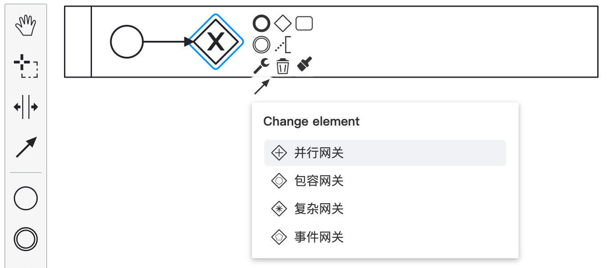
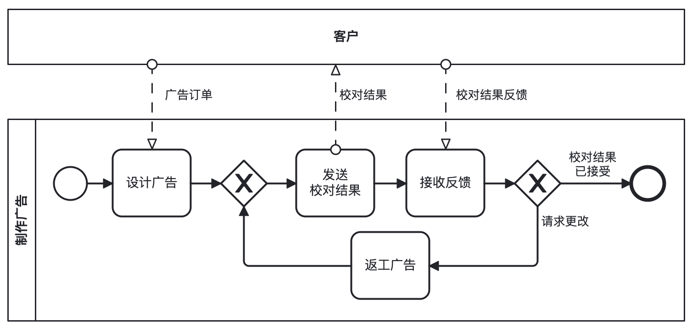
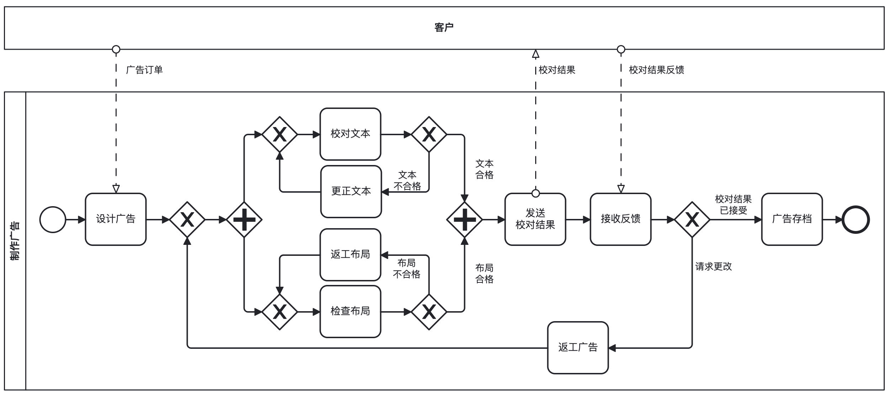

# BPMN 编辑器

**专为中文用户打造的标准 BPMN 编辑器 —— 开箱即用，无需配置，告别英文界面与小字号困扰。**

> 基于 [bpmn-js](https://bpmn.io/)，严格遵循 BPMN 2.0 规范。

## 中文场景深度优化

- **全界面汉化**：菜单、工具提示、属性面板均完整汉化
- **中文字体优先**：自动选用系统最佳中文字体（如微软雅黑、苹方）
- **字体大小适配**：任务、网关、连线标签字号经视觉调优，确保清晰易读
- **元素尺寸优化**：容器比例针对中文高信息密度特点重新设计

## 实用功能增强

- **跨页面复制粘贴**：轻松复用流程片段
- **缩放控制工具栏**：一键重置、放大或缩小画布

## 效果图

[样例](https://gitee.com/remyzane/vscode-zh-bpmn/tree/main/样例) 和 [效果图](https://gitee.com/remyzane/vscode-zh-bpmn/tree/main/效果图)（中文菜单、简单流程、复杂流程）

